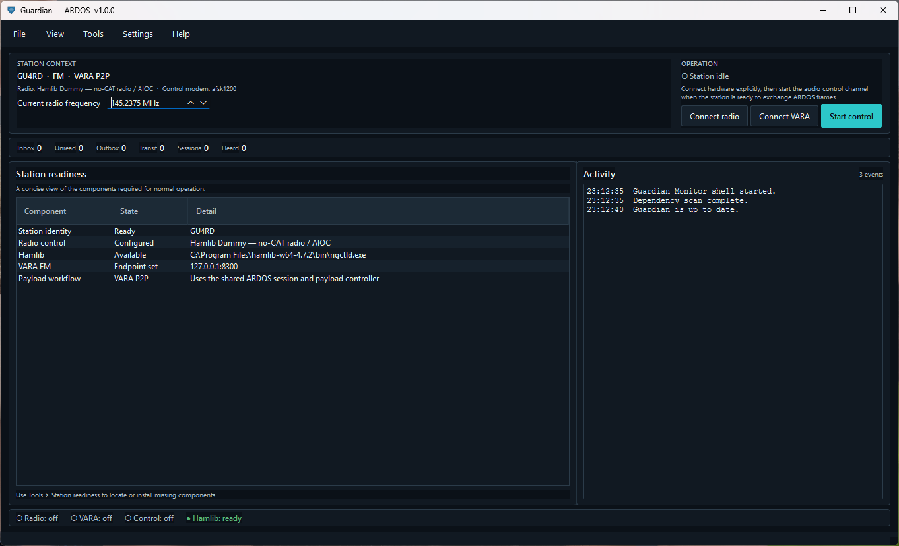
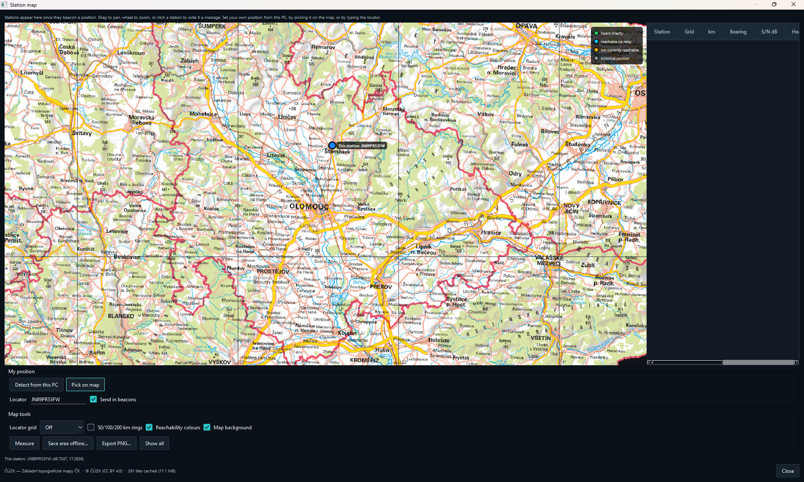

<div align="center">

# Guardian

### Resilient emergency messaging over amateur radio

**A Windows communication system for sending messages, files and structured emergency traffic directly over VHF/UHF FM or HF — without the Internet, Winlink or any central server.**

[](../../releases/latest)


[Download Guardian](../../releases/latest) · [Project Status](STATUS.md) · [Technical Details](PRODUCT.md)

</div>

---

<p align="center">
  
</p>

## What is Guardian?

Guardian turns a Windows PC and an amateur-radio transceiver into an independent digital messaging station.

Instead of relying on the Internet or a central messaging service, Guardian communicates **directly over radio**.

Operators can compose an email-like message, attach files, address it to another callsign and send it across an amateur-radio network.

Guardian handles:

* radio control;
* station discovery;
* route selection;
* relay stations;
* frequency changes;
* message queues;
* VARA data transfer;
* delivery tracking.

The result is a decentralized **store-and-forward radio messaging network** that can continue operating when normal network infrastructure is unavailable.

> Guardian is designed for licensed amateur-radio operation, experimentation and emergency-communications exercises. It is not a certified public-safety or life-safety system.

---

# Why Guardian?

Most digital amateur-radio applications solve one specific part of the communication chain.

Guardian tries to connect the entire workflow.

```text
      Compose a message
             │
             ▼
       Find destination
             │
      ┌──────┴───────┐
      │              │
   Direct RF      Relay path
      │              │
      └──────┬───────┘
             │
             ▼
   Negotiate radio link
             │
             ▼
       VARA FM / HF
             │
             ▼
     Message + files
             │
             ▼
     Delivery receipt
```

Guardian uses short **ARDOS control transmissions** to coordinate stations and VARA FM/HF to move the actual payload.

The control layer answers questions such as:

* Is the destination reachable?
* Which station should receive the message next?
* Is a relay required?
* Which frequency should be used?
* Is the receiving station busy?
* Was the message forwarded?
* Did it finally reach its destination?

The operator does not need to manually orchestrate every individual step.

---

# What can you use it for?

### 📻 Direct station-to-station messaging

Send text and attachments directly between two radio stations.

No Internet connection and no central mailbox are required.

---

### 🔁 Store-and-forward networks

A station that cannot reach the destination directly can hand the message to another Guardian station.

The relay stores the message locally and forwards it when the next hop becomes available.

```text
OK7AAA  ───►  OK7BBB  ───►  OK7CCC  ───►  OK7DDD
 Source         Relay          Relay       Destination
```

Delivery state follows the message across the network.

---

### 🧭 Automatic and assisted routing

Guardian can determine the next hop using several sources of information:

* manually configured routes;
* a shared network topology;
* stations heard directly on the radio;
* assisted route discovery;
* experimental live network topology.

Operators can therefore build anything from a simple two-station link to a larger regional radio network.

---

### 🚨 Emergency and structured traffic

Guardian includes structured message templates for:

* **ICS-213**
* **ICS-214**
* **IARU emergency messages**
* **SITREP**

Messages remain ordinary interoperable text inside the Guardian transport rather than being locked into a proprietary document format.

---

### 🗺️ Situational awareness

Guardian includes an operational station map.

<p align="center">
  
</p>

The map can show:

* your own station;
* recently heard stations;
* Maidenhead locators;
* radio links and message activity;
* distance and bearing;
* 50 / 100 / 200 km range rings;
* route availability;
* current network alerts.

A station can be selected directly on the map to start composing a message.

The map can also be prepared for offline operation and exported as PNG.

---

### ⚠️ Network alerts

Guardian stations can broadcast short network-wide alerts independently from ordinary mail.

Alerts can be received, displayed and relayed by other Guardian stations and can optionally be transmitted across configured channels.

---

# FM and HF

Guardian supports both **VARA FM** and **VARA HF**.

### Compression, VARA encryption and final Morse ID

* VARA keeps its native `COMPRESSION TEXT` baseline. The optional **VARA
  FILES compression** setting switches the modem to its file-transfer codec
  for Guardian's complete binary message bundle.
* **Adaptive Guardian compression** works before the selected payload modem,
  so it behaves the same over VARA and Guardian OFDM VHF. Its own selection
  engine losslessly compares stored ZIP, DEFLATE, BZIP2 and LZMA, a Guardian
  mixed strategy that chooses per entry, and bundled ZPAQ 7.15, PAQ8PX v187 and
  LPAQ8 high-ratio candidates. Each external candidate must pass a bounded
  decode plus SHA-256 round-trip before it may win. A small `GCP1` envelope is
  used only after the next hop actively advertises the matching decoder;
  otherwise the sender falls back to standard ZIP before payload transfer.
  No LLM or online service is used. Native VARA FILES and Guardian compression
  are mutually exclusive to avoid a counterproductive double-compression pass.
* VARA's optional **AES-256 encryption** can be configured for authorised
  non-amateur/commercial service. Both peers need the same fixed key. Observe
  the rules of the radio service and frequency in use; encrypted amateur-radio
  traffic is prohibited in many jurisdictions.
* A disabled-by-default option makes the final receiving station append
  `SENDER DE RECEIVER` once in Morse at **40 WPM**, after its final control
  acknowledgements have left the radio.

The same mailbox and routing model can therefore be used for local VHF/UHF networks and longer-distance HF communication.

|               | FM               | HF                       |
| ------------- | ---------------- | ------------------------ |
| Control modem | AFSK 1200        | MFSK-16                  |
| Payload       | VARA FM          | VARA HF                  |
| Typical use   | Local / regional | Regional / long distance |
| Routing       | ✅                | ✅                        |
| Relay         | ✅                | ✅                        |
| Attachments   | ✅                | ✅                        |

Guardian automatically selects the appropriate ARDOS control modem for the operating mode.

---

# Calling and working channels

Guardian can operate everything on one frequency or separate the network into a **calling channel** and a **working channel**.

For example:

```text
145.500 MHz
ARDOS calling / coordination
       │
       │ stations negotiate
       ▼
145.350 MHz
VARA payload transfer
       │
       ▼
145.500 MHz
return to calling channel
```

With CAT-controlled radios, Guardian can perform the required QSY automatically.

Radios without CAT can still be used through an operator-confirmed tuning workflow.

---

# The Guardian workspace

Guardian 1.0 provides task-oriented workspaces instead of exposing protocol internals to the operator.

### Home

Station status, radio and VARA connectivity, control-channel state and current operation.

### Mail

A local store-and-forward mailbox with:

* Inbox
* Outbox
* Sent
* Transit

Messages can contain text, structured traffic and file attachments.

### Network

One operational view for:

* Routes
* Heard stations
* Network builder
* Route discovery
* Live topology

Routes clearly show **where the information came from** instead of mixing permanent configuration and temporary RF observations.

### Log

Operational and diagnostic information for troubleshooting radio, control-channel and payload activity.

---

# Shared network topology

A Guardian network can be planned centrally without manually creating a different routing table for every computer.

Define the links once:

```text
        OK7BBB
       /      \
OK7AAA          OK7DDD
       \      /
        OK7CCC
```

The same topology can be distributed to all stations.

Each Guardian installation uses its own callsign to calculate the appropriate local next-hop routes automatically.

Manual routes remain available as overrides.

---

# Assisted route discovery

Guardian can also search for a destination that is not already present in the configured topology.

Stations cooperate using bounded multi-hop route discovery.

```text
SOURCE
  │
  ├──► Relay A
  │       │
  │       └──► Relay B
  │                │
  │                └──► DESTINATION
  │
  ◄──────── discovered route ────────
```

Discovery is deliberately bounded to avoid uncontrolled radio traffic.

The resulting dynamic route is temporary and remains distinct from permanent network configuration.

In Assisted mode the source operator can review a discovered path before the payload is transmitted.

---

# Radio integration

Guardian supports a wide range of radios through **Hamlib / rigctld**.

Depending on the radio and interface, Guardian can control:

* frequency;
* mode;
* PTT;
* signal level;
* automatic QSY.

For simpler radios and interfaces, serial RTS/DTR PTT is also supported.

This makes Guardian usable with both modern CAT-controlled transceivers and much simpler FM radios.

---

# Radio profiles

Different radios and interfaces can be stored as named profiles.

For example:

```text
IC-705 Portable
IC-705 Base
AIOC Handheld
FTDX10 HF
```

Changing station hardware therefore does not require re-entering the complete CAT and PTT configuration.

---

# Spectrum and waterfall

Guardian includes its own VARA monitoring window.

It provides:

* live RX spectrum;
* waterfall;
* RX/TX frequency;
* PTT state;
* VARA connection state;
* FM/HF passband scaling.

The monitor observes the selected radio input and does not independently key the transmitter.

---

# Designed for offline operation

The radio messaging system itself does not require Internet access.

Messages, attachments, routes, heard stations and delivery state are stored locally.

Network access is used only for optional functions such as:

* downloading updates;
* installing verified Hamlib packages;
* downloading VARA after operator confirmation;
* obtaining map tiles before offline use;
* optional Windows position detection.

Once the required software and map data are present, the core messaging system operates over radio.

---

# Guardian G2 soundcard modem — waveforms of Guardian's own

Guardian **2.3.3** expands the experimental payload transport that needs no VARA at all. Guardian generates the waveform itself, puts it on the air through the soundcard and keys the radio through its own PTT.

Select it in *Settings → Payload* as **Guardian G2 soundcard modem (Experimental)**. VARA P2P stays the default, and a G2 modem station and a VARA station can talk to each other: the two peers agree on a transport during the ordinary control handshake, and unless *both* are configured for the built-in modem the pair falls back to VARA before anything is transmitted.

The proven OFDM implementation is retained unchanged as the default. Version 2.3 adds three independently selectable experimental waveform modules: **SC-HS** (single-carrier Nyquist signaling with frequency-domain equalisation), **SC-FTN** (faster-than-Nyquist signaling at \(\tau=0.90\)), and **SEFDM** (compressed non-orthogonal multicarrier signaling). Version 2.3.1 moves SEFDM to the measured robust point \(\alpha=0.985\), adds a joint time/carrier equalizer and uses denser pilots; MCS6 32-APSK passes the reproducible realistic-channel test. The single-carrier modes add 256-QAM, 16-APSK and 32-APSK choices. All four families reuse the established framing, FEC, interleaving, CRC and selective-repeat ARQ; the existing control frames and transport negotiation stay unchanged.

The reproducible software model transfers an 8 KiB payload at about **949 B/s** with the existing 2.7 kHz-class OFDM benchmark, **1,412 B/s** with SC-HS and **1,553 B/s** with SC-FTN, including framing, FEC, ACK and a 250 ms PTT turnaround. SEFDM now completes the same transfer at 654 B/s with one selective retry; it is robust enough to test, but not the capacity winner. These are channel-model results, not an on-air guarantee. The complete assumptions and radio-test procedure are in [the Guardian G2 2.3.1 waveform report](docs/G2_WAVEFORM_LAB_2.3.1.md).

Version 2.3.2 adds **Operation → Station test & AutoTune**. Two consenting Guardians exchange bounded measuring bursts in both directions, test the actual radio/audio path and propose a safe per-waveform digital drive. On Windows it can also sweep the selected radio output endpoint: an A/B measurement first proves whether that mixer really changes the remote level, and the original mixer state is restored after completion, cancellation, timeout or failure. Raw JSON/CSV evidence is always saved and no recommendation is applied until the operator reviews it.

The payload link can now concatenate independently CRC-protected microbursts under one PTT and receive one cumulative selective-repeat ACK. A robust POLL recovers a lost final burst or ACK. The compatibility default remains one microburst; increase it only when both peers run 2.3.2. In the deterministic 8 KiB SC-FTN/FEC 7/8 test, four microbursts per train improved modeled channel goodput from 6,166 to 7,840 bit/s (**+27.1%**). A 64 KiB run reduced data/ACK PTT pairs from 8+8 to 4+4 and improved 8,541 to 9,058 bit/s (**+6.1%**); these are lab figures, not an RF guarantee. Details are in [the Guardian G2 2.3.2 station-lab report](docs/G2_STATION_LAB_2.3.2.md).

**The PHY has been on the air; adaptive format 2 still needs its first flight.** Two IC-705s, 2026-08-09: messages moved, and the audio path turned out to pass about 3 kHz — which makes `BENCH` the profile to use and `WIDE_5K` and above unreachable on that radio. The run also proved that repeated 512-byte PTT/ACK cycles, not raw PHY speed, dominated transfer time. [docs/OFDM_AIR_RESULTS_2026-08-09.md](docs/OFDM_AIR_RESULTS_2026-08-09.md) is what those radios measured, [the adaptive/selective-repeat note](docs/OFDM_G2_ADAPTIVE_ARQ.md) describes this implementation and first-test parameters, [docs/ofdm-vhf.md](docs/ofdm-vhf.md) has the full design, and [docs/OFDM_AIR_TEST.md](docs/OFDM_AIR_TEST.md) is the procedure ([česky](docs/OFDM_AIR_TEST.cs.md)).

### Testing it without a radio

**Tools ▸ Modem test** lets an operator select OFDM, SC-HS, SC-FTN or SEFDM, choose its profile and modulation, inspect a deterministic single burst, transmit a test burst through the configured radio, write a clean WAV, or decode a recorded WAV back to bytes. The original OFDM simulator remains at `tools/ofdm_bench.py`; the fair cross-family comparison is `tools/g2_waveform_bench.py`.

No console, no scripts. (`tools/ofdm_bench.py` prints the same measurements for a developer who wants them in a terminal — it is a thin front end over the same engine.)

### Recording what the radio heard

Guardian records received audio to a WAV file, in exactly the format its own offline tools read, so an on-air test needs nothing but Guardian and a radio. While it runs you can see the elapsed time and the peak level; when you stop, it says whether the capture was silent, clipping or usable, and can decode it on the spot to report sync confidence, SNR, EVM and frequency offset. Captures land in `%APPDATA%\Guardian-G2\captures\`.

This is how the modem gets tuned: a capture lets the whole receiver be re-run over precisely what a radio produced, long after the radios are away.

---

# Current status

Guardian **1.0.0** was the first release where the interface and documentation were consolidated around the radio functionality developed and tested throughout the 0.6 series. **2.3.3** is the current Guardian G2 capacity-modem release. It adds width-selectable SC/SEFDM profiles through 20K, SC-FDE-FTN, a denser APSK/QAM/GQAM ladder, PAS64, modern LDPC with soft HARQ combining, adaptive MCS/train control and the opt-in protocol-v3 superframe. See [the 2.3.3 release notes](docs/RELEASE_NOTES_2.3.3.md) and [capacity-modem measurement guide](docs/G2_CAPACITY_MODEM_2.3.3.md).

| Capability                      | Status                             |
| ------------------------------- | ---------------------------------- |
| Direct VARA FM messaging        | ✅ Confirmed on air                 |
| Direct VARA HF messaging        | ✅ Confirmed on air                 |
| AFSK FM control channel         | ✅ Confirmed on air                 |
| MFSK HF control channel         | ✅ Confirmed on air                 |
| Attachments                     | ✅ Confirmed on air                 |
| Network alerts                  | ✅ Confirmed on air                 |
| Automatic CAT QSY               | ✅ Confirmed on hardware            |
| Calling / working channel split | ✅ Confirmed on air                 |
| Production channel scanner      | ✅ Confirmed on hardware            |
| No-CAT / serial PTT operation   | ✅ Confirmed on hardware            |
| Shared network topology         | ✅ Implemented                      |
| Assisted multi-hop discovery    | 🧪 Implemented and software tested |
| Live topology advertisements    | 🧪 Experimental                    |

See [STATUS.md](STATUS.md) for the complete engineering and field-verification record.

---

# Installation

## Windows release

Download the latest installer:

### **[→ Download Guardian](../../releases/latest)**

The Windows package already contains Python and the required Python libraries.

A separate Python installation is not required.

> **Windows warning**
>
> Current builds are not Authenticode signed. Windows may therefore display **Unknown publisher** or a Microsoft Defender SmartScreen warning.
>
> Download Guardian only from this repository's Releases page and verify the supplied SHA-256 manifest when required.

---

# First start

After installing Guardian:

1. Open **Operation → Station readiness**
2. Enter your callsign
3. Configure the radio
4. Select RX and TX audio devices
5. Locate or install Hamlib
6. Locate or install VARA FM / VARA HF
7. Connect the radio
8. Connect VARA
9. Start the ARDOS control channel
10. Compose a message

Guardian does **not** automatically begin transmitting when the application starts.

RF activity is explicitly initiated by the operator.

---

# VARA

Guardian uses VARA as the payload modem but does not redistribute it.

VARA remains separately licensed third-party software.

The Station Readiness assistant can, after operator confirmation:

1. download the reviewed VARA archive from the official distribution server;
2. verify its expected size and SHA-256;
3. ask again before starting the vendor installer.

Guardian never silently accepts or installs third-party software.

---

# Hamlib

Guardian communicates with CAT radios through `rigctld`.

Hamlib can be installed automatically from:

**Operation → Station readiness**

Guardian downloads the reviewed portable package, verifies it and installs it into the Guardian application-data directory.

Administrator rights are not normally required.

---

# Running from source

Python **3.11 or later** is required when running Guardian from source.

```powershell
git clone https://github.com/bubakbubak500/ARDOS-Guardian.git
cd ARDOS-Guardian

.\setup.ps1
.\run.ps1
```

To create the standalone Windows build:

```powershell
.\build.ps1
```

Output:

```text
dist\Guardian\Guardian.exe
```

---

# Documentation

The README provides the high-level overview of Guardian.

Detailed design and implementation information is intentionally kept elsewhere:

* **[PRODUCT.md](PRODUCT.md)** — product scope and operational boundaries
* **[STATUS.md](STATUS.md)** — development history, field tests and current verification
* **[docs/MULTIHOP_DISCOVERY.md](docs/MULTIHOP_DISCOVERY.md)** — multi-hop discovery
* **[SECURITY.md](SECURITY.md)** — security policy
* **[GitHub Releases](../../releases)** — installers and release notes

---

# Safety and regulatory responsibility

Guardian automates parts of a radio communication workflow.

It does **not** determine whether a transmission is legal.

The operator remains responsible for:

* possessing the required amateur-radio licence;
* permitted frequencies;
* bandwidth and emission mode;
* transmit power;
* identification requirements;
* third-party traffic restrictions;
* local amateur-radio regulations.

Guardian is experimental software and must not be the sole communication system for situations involving immediate risk to life.

---

# Contributing and field testing

Guardian is developed around real radio operation.

Field reports are particularly useful.

When reporting a radio-related problem, please include where possible:

* Guardian version;
* radio model;
* interface;
* CAT / PTT configuration;
* VARA FM or VARA HF;
* frequency and mode;
* relevant Guardian diagnostic export.

Bug reports and development discussions are welcome through **[GitHub Issues](../../issues)**.

---

<div align="center">

### Guardian

**Messages when the network isn't there.**

From HAMs to HAMs

</div>
