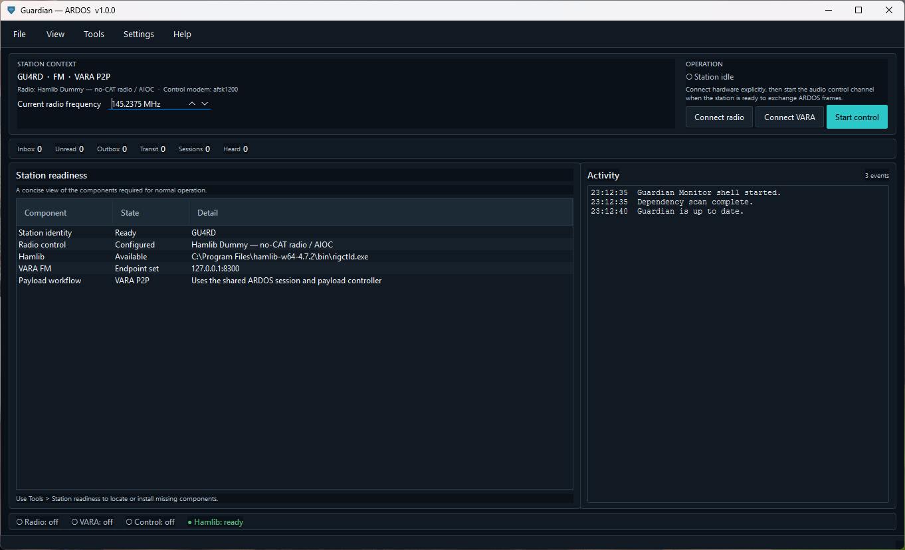

<div align="center">

# Guardian

### One connected ecosystem. More ways to operate your station.

**Send messages, files and structured traffic over amateur radio without an Internet connection or central server.**

[](../../releases/latest)


[](../../releases)

[Download Guardian](../../releases/latest) · [Explore the ecosystem](#one-ecosystem-several-ways-to-communicate) · [Project status](STATUS.md)

☕ **Like Guardian?**

If you find the project useful and want to support its continued development:

**[Buy me a coffee on Ko-fi](https://ko-fi.com/bubakbubak500)**

</div>

<p align="center">
  
</p>

## One ecosystem, several ways to communicate

Guardian is the Windows station console and the common mailbox for this ecosystem. It manages radio links, routing and delivery. The connected projects let you work with that same station from a Guard Mesh touch device or use supported Quansheng and Baofeng handhelds as integrated radios. You can also operate Guardian with other compatible transceivers.

| Project | What it does | Where to start |
| --- | --- | --- |
| **[Guardian](https://github.com/bubakbubak500/ARDOS-Guardian)** | Windows application for direct and store-and-forward messages, attachments, emergency forms and radio network operations. | [Windows releases](../../releases/latest) |
| **[GUARD-MESH](https://github.com/bubakbubak500/GUARD-MESH)** | Guardian-focused fork of WadaMesh for supported MeshCore touch devices. Its Guardian BLE app can show PC station information and compose messages for Guardian's Outbox. | [Repository and device list](https://github.com/bubakbubak500/GUARD-MESH) · [Guardian BLE app](https://github.com/bubakbubak500/GUARD-MESH/blob/main/docs/GUARDIAN-BLE.md) |
| **[Guardian K5FW](https://github.com/bubakbubak500/Guardian-K5FW-Releases)** | Firmware and K5 Manager binary releases for the **Quansheng UV-K5 V1 (DP32G030)**. | [Firmware and Manager releases](https://github.com/bubakbubak500/Guardian-K5FW-Releases/releases) |
| **[Guardian K61FW](https://github.com/bubakbubak500/Guardian-K61FW-Releases)** | Firmware releases for the **Baofeng UV-K61**. Separate images target the FD6818 and FD6818B hardware variants. | [Firmware releases and compatibility notes](https://github.com/bubakbubak500/Guardian-K61FW-Releases) |

### Choose how you operate

- **At the PC:** compose, receive and track messages in Guardian, using a compatible HF, VHF or UHF radio.
- **With a handheld:** use Guardian K5FW or K61FW on the supported radio for a dedicated AIOC/UART control path into the same Guardian station.
- **From a Guard Mesh touch device:** view Guardian's live status and messages over BLE, browse contacts and submit a text message to Guardian's Outbox. Guardian then sends it using its configured radio path.
- **Across two radios:** attach an optional second radio to one Guardian mailbox and forward traffic between radio paths.

The handheld firmwares are optional. Guardian also supports Hamlib, serial PTT and operator-controlled no-CAT setups. **Check the exact radio and chip variant before flashing any firmware.** Each firmware release repository provides its own compatibility notes.

### How the pieces fit

```text
                         GUARD-MESH device
                    status, contacts and messages
                              ⇅ BLE
                     Guardian on Windows
                   mailbox · routing · radio control
                              ⇅ audio / CAT / AIOC
                  HF, VHF or UHF transceiver
                              ⇅ RF
                 another Guardian station or relay
```

Guard Mesh is a **local Bluetooth companion** to the PC application. A message composed on a supported Guard Mesh device is queued in Guardian's normal Outbox; Guardian applies its usual radio delivery rules. The Guard Mesh project also has its own MeshCore radio functions. Connecting the two does not make their radio networks interchangeable or create an automatic gateway between them.

## Production LAB

Open **Tools → Production LAB** to run two isolated Guardian stations on one PC, compare SC-FTN, VARA and ARDOP, and watch live measurements. The LAB uses this release's production runtime and control protocols. It also provides a local HTTP API and CLI for repeatable campaigns. See the [LAB setup, measurement and maintenance guide (Czech)](docs/GUARDIAN_LAB_CS.md).

## What Guardian does

- **Direct messaging:** address text and attachments to another station by callsign.
- **Store-and-forward:** keep messages locally and relay them through other Guardian stations when a direct path is unavailable.
- **Routing and discovery:** use manual routes, shared topology, heard stations and bounded assisted multi-hop discovery.
- **Delivery visibility:** follow Outbox, Transit and Sent state, acknowledgements and radio activity.
- **Structured traffic:** compose ICS-213, ICS-214, IARU emergency and SITREP messages.
- **Network operations:** view heard stations and routes on an operational map, send short network alerts and inspect logs.
- **Two radios:** optionally run independent radio, audio, modem and PTT paths against one shared mailbox, including forwarding between them.

Guardian keeps messages, attachments, routes and station settings locally. The core message path runs over radio. Internet access is used only for optional downloads, updates and map data.

### Radio and modem options

| Payload path | Role |
| --- | --- |
| **VARA FM / VARA HF** | Established FM and HF payload options. VARA is separately licensed third-party software and is not bundled with Guardian. |
| **Guardian SC-FTN** | Guardian's own sound-card payload modem, negotiated per hop with a compatible peer. VARA remains available as a fallback where configured. |
| **Guardian ARDOP 500 Hz** | Experimental narrow-band payload option bundled as a native library. Both stations must select a compatible mode and configure suitable SSB radio settings. |

Short ARDOS control transmissions coordinate stations and transfers. Depending on the selected mode, Guardian uses AFSK 1200, MFSK-16 or narrow ARDOP control frames. A calling channel and a separate working channel can be configured; CAT-controlled radios can change frequency automatically, while other radios use an operator-confirmed workflow.

Guardian can control many radios through **Hamlib / rigctld**. It also supports serial RTS/DTR PTT and the dedicated Guardian K5FW/K61FW AIOC/UART paths. Named radio profiles make it easier to switch station hardware.

## Guard Mesh companion

With a paired device running a compatible Guard Mesh build, Guardian can share live station and transfer status over Bluetooth LE. The BLE v2 interface also supports contacts, message lists, plain-text reading and submitting a new message to Guardian's Outbox. Attachments are not transferred through this interface. Pairing is under **Settings → Station settings → Guard Mesh**.

After the first connection, Guardian remembers the device and reconnects automatically if it goes out of range, Bluetooth is temporarily unavailable, or Guardian restarts. It keeps trying in the background while Guardian is running, including when Settings is closed. **Disconnect / cancel** stops the attempts and forgets the device. Reconnection scans only for the Guard Mesh BLE service and does not take over other Bluetooth devices.

The features available on a device depend on its firmware and Guardian BLE app version. See the [GUARD-MESH project](https://github.com/bubakbubak500/GUARD-MESH) and the [BLE API reference](docs/GUARD_MESH_BLE_V2_CS.md) for details.

## Get started

1. [Download the latest Guardian installer or portable ZIP](../../releases/latest).
2. Open **Operation → Station readiness** and enter your callsign.
3. Configure the radio, PTT and RX/TX audio devices.
4. Choose and configure a payload modem. Install VARA separately if you select VARA FM or HF.
5. Connect the radio, start the control channel and compose a message.

The Windows package includes Python and the required Python libraries. Station readiness can help install a verified portable Hamlib package and can download a reviewed VARA installer **only after operator confirmation**. Starting Guardian does not key the transmitter or start RF audio automatically.

Current Windows builds are not Authenticode signed, so Windows may show an **Unknown publisher** or SmartScreen warning. Download from this repository's [Releases page](../../releases) and verify the supplied SHA-256 checksums when needed.

### Run from source

Python **3.11 or later** is required:

```powershell
git clone https://github.com/bubakbubak500/ARDOS-Guardian.git
cd ARDOS-Guardian
.\setup.ps1
.\run.ps1
```

To build the standalone Windows application, run `.\build.ps1`. The output is `dist\Guardian\Guardian.exe`.

## Status and documentation

Guardian includes features at different stages of verification. Direct VARA messaging and several radio-control workflows have been tested on air or on hardware. Assisted multi-hop discovery, SC-FTN and ARDOP have software validation, with physical-radio verification varying by feature and release. Read the [engineering status](STATUS.md) and [release notes](docs/RELEASE_NOTES_1.1.17.md) before relying on a specific workflow.

- [Product scope and safety boundaries](PRODUCT.md)
- [Engineering and field-verification record](STATUS.md)
- [Multi-hop discovery](docs/MULTIHOP_DISCOVERY.md)
- [Guard Mesh BLE interface](docs/GUARD_MESH_BLE_V2_CS.md)
- [Security policy](SECURITY.md)
- [GitHub releases](../../releases)

## Responsible operation

Guardian is intended for licensed amateur-radio operators, experiments and emergency-communications exercises. It is **not a certified public-safety or life-safety system**. Operators remain responsible for permitted frequencies, bandwidth, power, identification, third-party traffic and local regulations. Keep another communication option available where immediate safety depends on delivery.

Field reports are welcome in [GitHub Issues](../../issues). Include the Guardian version, radio and interface, modem, frequency, PTT setup and a relevant diagnostic export where possible.

<div align="center">

**Messages when the network isn't there.**

From HAMs to HAMs · OK7PS / OK2IPW / OK6LZ / OK2MTV

</div>
